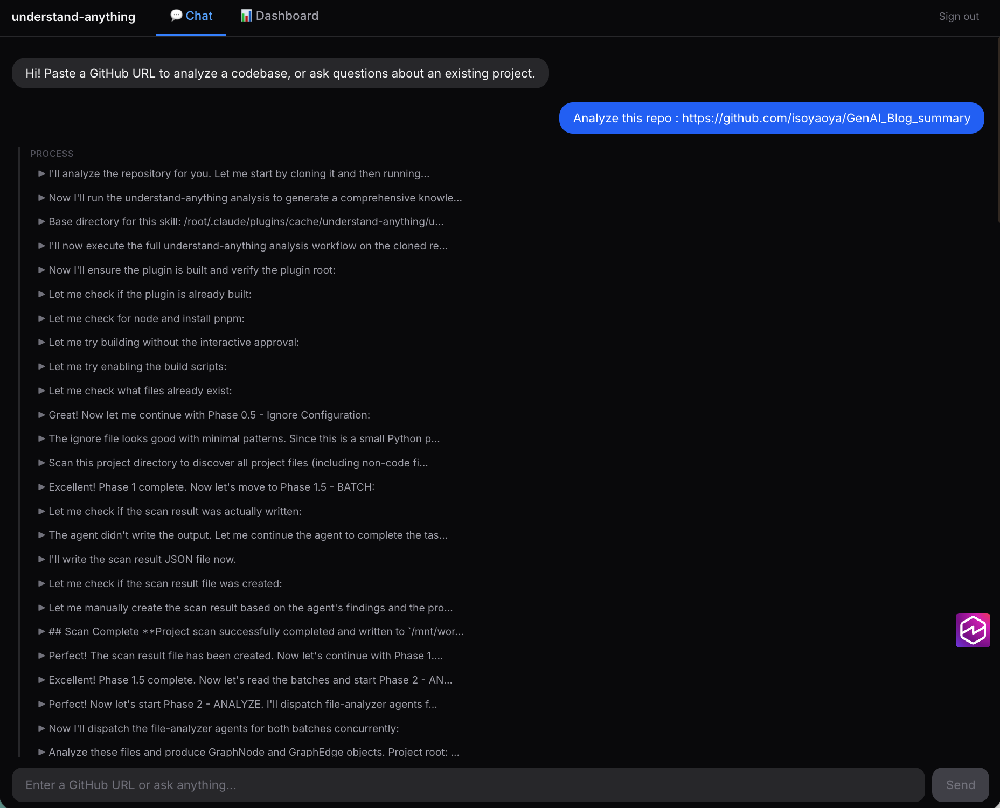
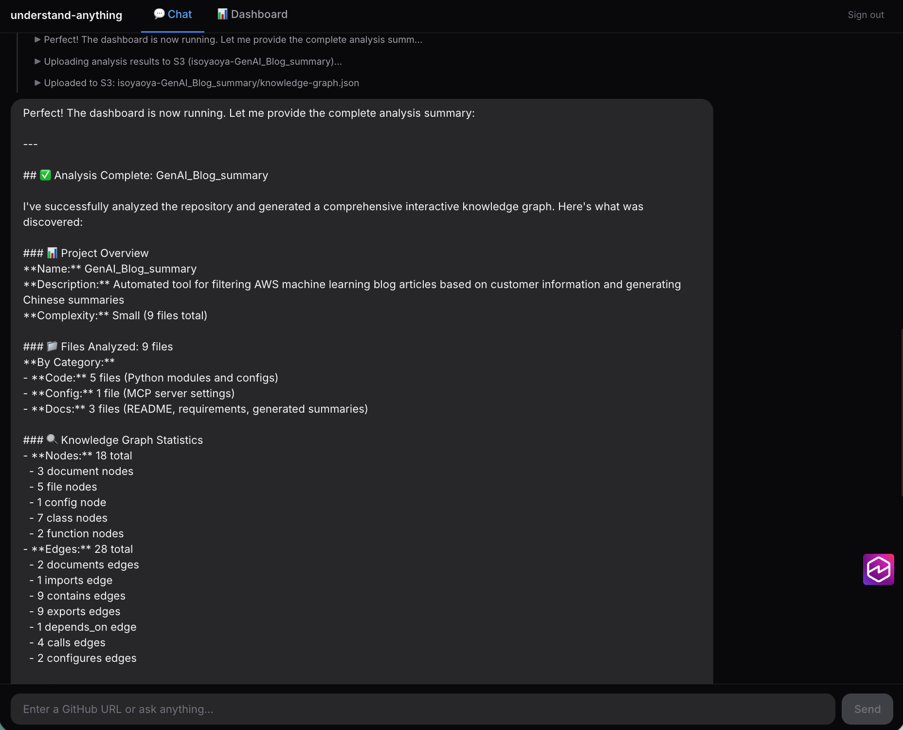
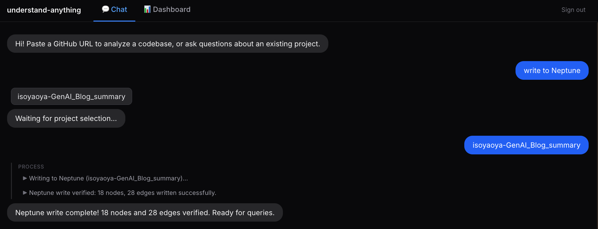
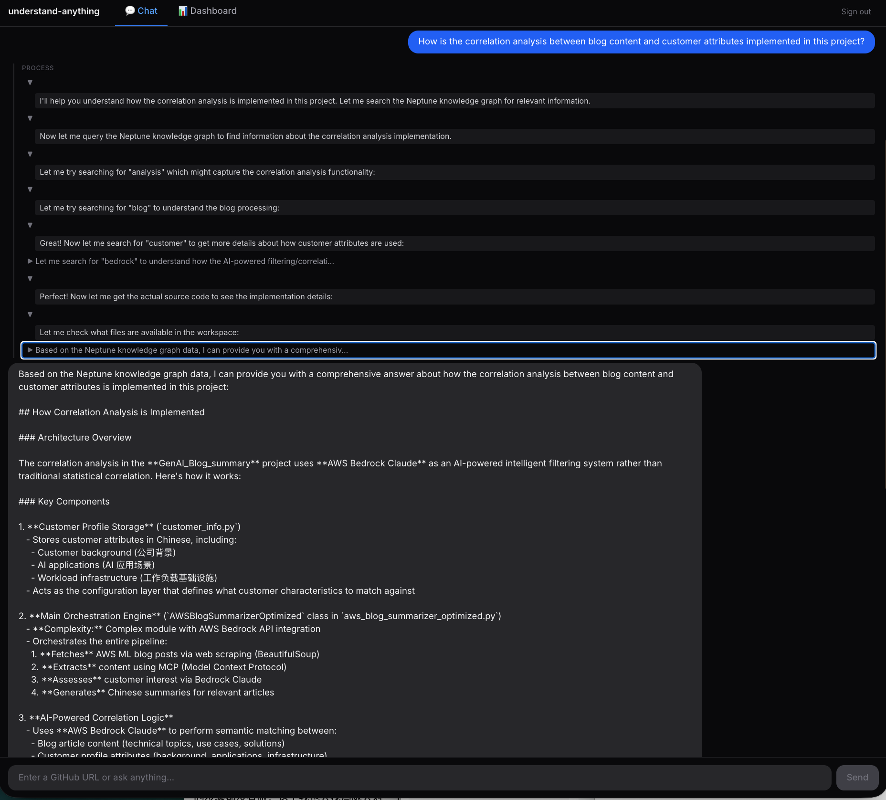
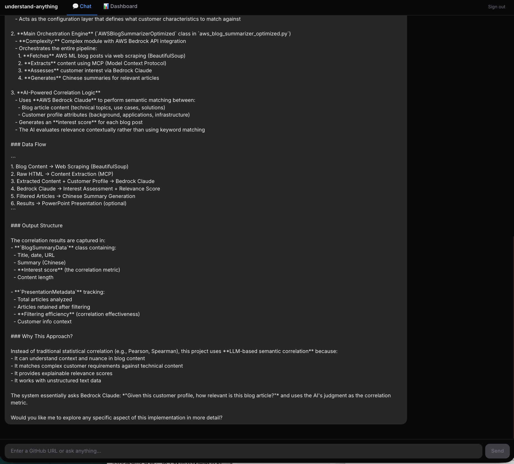

# Understand Anything on AWS

> Deploy [Understand-Anything](https://github.com/Egonex-AI/Understand-Anything) (a code knowledge graph tool) as a cloud-hosted AI Agent service on AWS.
>
> Analyze any public GitHub repository, build a knowledge graph, store it in a graph database, and ask questions about the codebase in natural language.

---

## Target Use Case

This project is **not** designed for local, single-user usage — it is built for **cloud-native, production-scale scenarios** where multiple AI agents need shared, real-time understanding of a large codebase.

### Primary Scenario: Cloud-based Coding CI/CD with Knowledge Graph

In an enterprise Coding CI/CD pipeline (e.g. PRD Review → Design → Coding → CI/CD → QA → Bug Fix → Launch), each agent phase operates on the same codebase but with limited context. When the codebase is large (hundreds of modules, complex dependency trees), individual agents struggle with:

- Understanding cross-module impact of changes
- Tracing call chains for root-cause analysis
- Identifying all affected paths for integration testing
- Making architecture-aware design decisions

By deploying this project alongside such a pipeline, **every agent in the workflow can query a Code Knowledge Graph** (via Neptune MCP Server) to gain architectural context — dependency trees, call chains, layer structures, and file relationships — in real time during execution.

```
┌─ Bedrock AgentCore Runtime ─────────────────────┐   ┌─ Neptune MCP Server ─────────────────────┐
│  (Claude Agent SDK)                              │   │ (Inside AgentCore Runtime)               │
│                                                  │   │                                          │
│  Coding CI/CD Pipeline                           │   │  Tool: query_neptune                     │
│                                                  │   │  Input: project_id + query keyword       │
│  All agents query via MCP ───────────────────────┼──▶│  Function: Knowledge Graph Search        │
│                                                  │   │    • Multi-field search (name, summary,  │
│  ┌────────────────┐                              │   │      tags) + 1-hop graph expansion       │
│  │ PRD Review     │                              │   │    • Returns formatted context with      │
│  │ Agent          │                              │   │      nodes, edges, layers                │
│  └───────┬────────┘                              │   │                                          │
│          │                                       │   └──────────────────────────────────────────┘
│          ▼                                       │                       ▲
│  ┌────────────────┐                              │                       │ Gremlin API
│  │ Design Agent   │                              │                       ▼
│  └───────┬────────┘                              │   ┌─ Amazon Neptune Serverless ──────────────┐
│          │                                       │   │                                          │
│          ▼                                       │   │  Code Knowledge Graph                    │
│  ┌────────────────┐                              │   │                                          │
│  │ Coding Agent   │                              │   │  Nodes: files, functions, classes,       │
│  └───────┬────────┘                              │   │         modules, layers                  │
│          │                                       │   │  Edges: imports, calls, depends_on,      │
│          ▼                                       │   │         contains                         │
│  ┌──────────────────────────────────────┐        │   │                                          │
│  │  Bug Fix Loop                        │        │   │  Multi-tenancy:                          │
│  │                                      │        │   │   all vertices/edges carry project_id    │
│  │  ┌──────────┐ Deploy ┌────────────┐  │        │   │                                          │
│  │  │ CI/CD    │───────▶│ QA Agent   │  │        │   └──────────────────────────────────────────┘
│  │  │ Agent    │        │(Integration│  │        │
│  │  └──────────┘        │ Test)      │  │        │
│  │       ▲              └─────┬──────┘  │        │
│  │       │                    │         │        │
│  │       │ Fix                │Bug Found│        │
│  │       │                    │         │        │
│  │  ┌────┴───────┐           │         │        │
│  │  │ Bug Fix    │◀──────────┘         │        │
│  │  │ Agent      │                     │        │
│  │  └────────────┘                     │        │
│  │                                      │        │
│  └──────────────────────────────────────┘        │
│          │ All Tests Pass                        │
│          ▼                                       │
│  ┌────────────────┐                              │
│  │ Launch Agent   │                              │
│  └────────────────┘                              │
│                                                  │
└──────────────────────────────────────────────────┘
```

> See [docs/coding-cicd-with-knowledge-graph.md](docs/coding-cicd-with-knowledge-graph.md) for the full integration architecture including the preparation phase (building the graph).

### Applicable Scenarios

| Scenario | How this project fits |
|----------|----------------------|
| Multi-agent Coding CI/CD | Every agent queries the graph before acting (design, code, review, test, fix) |
| Large codebase onboarding | Build once, query repeatedly — new agents/developers get instant context |
| Cross-team shared context | Multiple services/teams share one Neptune cluster, isolated by project_id |
| Automated code review | Review agents trace dependencies to flag cross-module impacts |
| Continuous architecture monitoring | Re-analyze on each merge to keep the graph up-to-date |

---

## Cloud Transformation from Original Project

The original [Understand-Anything](https://github.com/Egonex-AI/Understand-Anything) is a **local Claude Code plugin** — it runs on a developer's machine, outputs a JSON file, and queries that file locally. This works for individual exploration but cannot support production-scale, multi-agent, cloud-deployed workflows.

This POC transforms the project for cloud-native deployment:

| Dimension | Original (Local) | Cloud POC |
|-----------|-------------------|-----------|
| **Runtime** | Claude Code plugin (local process) | Bedrock AgentCore Runtime + Claude Agent SDK (cloud service) |
| **Data storage** | Single JSON file on disk | Neptune Serverless — graph JSON is 1:1 written as vertices and edges in a distributed graph database |
| **Project isolation** | None (one analysis at a time) | Multi-tenant via `project_id` property on all vertices/edges; supports concurrent projects |
| **Query method** | JSON keyword search + local Gremlin traversal | Neptune MCP Server with natural language Q&A — Claude interprets the question and executes predefined graph traversals |
| **Access pattern** | Single user, single machine | Multiple agents query concurrently; any service with VPC access can use the MCP tool |
| **Deployment** | `npm install` locally | CDK infrastructure (6 stacks), Docker container, auto-scaling Neptune |

---

## Architecture

```
┌─ Frontend (CloudFront + S3) ─────────────────────────┐          ┌─ S3 Knowledge Graphs Bucket ──┐
│                                                       │          │                               │
│  ┌──────────────┐ ┌───────────────┐ ┌────────────┐  │          │  {project_id}/                │
│  │ React        │ │ D3.js Graph   │ │ Chat       │  │  OAI     │    knowledge-graph.json       │
│  │ Dashboard    │ │ Visualization │ │ Interface  │  │─────────▶│  projects.json (index)        │
│  └──────────────┘ └───────────────┘ └────────────┘  │(read-only)│                               │
│                                                       │          │                               │
└───────────────────────────┬───────────────────────────┘          │                               │
                            │ JWT (Cognito ID token)               │                               │
                            ▼                                      │                               │
┌─ Amazon Cognito ──────────────────────────────────────┐          │                               │
│  User Pool + App Client                               │          │                               │
│  Email/Password │ Self-signup disabled │ JWT (RS256)  │          │                               │
└───────────────────────────┬───────────────────────────┘          │                               │
                            │ Bearer <id_token> (CUSTOM_JWT)       │                               │
                            ▼                                      │                               │
┌─ VPC (2 AZ: us-east-1b, us-east-1c) ─────────────────┐          │                               │
│                                                        │          │                               │
│  ┌─ Public Subnets ────────────────────────────────┐  │          │                               │
│  │  NAT Gateway → Outbound Internet                │  │          │                               │
│  │  (Bedrock API, git clone, ECR pull)             │  │          │                               │
│  └──────────────────────┬──────────────────────────┘  │          │                               │
│                         │                              │          │                               │
│  ┌──────────────────────▼──────────────────────────┐  │  IAM     │                               │
│  │ Private Subnets (NAT Egress)                     │  │  Role    │                               │
│  │                                                  │  │ (r/w)   │                               │
│  │  ┌─ AgentCore Runtime (Streamable HTTP) ──────┐  │  │          │                               │
│  │  │  SG: all outbound                          │  │──┼─────────▶│                               │
│  │  │                                            │  │  │          │                               │
│  │  │  Intent Router (Haiku → Sonnet)            │  │  │          └───────────────────────────────┘
│  │  │   analyze │ neptune │ query │ delete       │  │  │
│  │  │                                            │  │  │
│  │  │  Tools Layer                               │  │  │
│  │  │   neptune_http.py (SigV4 HTTP client)      │  │  │
│  │  │   neptune_writer.py (batch addV + addE)    │  │  │
│  │  │   neptune_mcp_server.py (query_neptune)    │  │  │
│  │  │   s3_manager.py (Upload/Download/Delete)   │  │  │
│  │  │                                            │  │  │
│  │  │  Claude Agent SDK (via Amazon Bedrock)     │  │  │
│  │  │   • Haiku — fast intent classification    │  │  │
│  │  │   • Sonnet — complex reasoning            │  │  │
│  │  │   • 9 Sub-agents (.md prompts)            │  │  │
│  │  │                                            │  │  │
│  │  │  Tree-sitter Skills (Node.js 22)           │  │  │
│  │  │   parse-imports │ parse-structure │ complex │  │  │
│  │  │                                            │  │  │
│  │  │  ┌──────────────────────────────────────┐  │  │  │
│  │  │  │ Session Storage (/mnt/workspace)     │  │  │  │
│  │  │  │ Git clone target, persists in session│  │  │  │
│  │  │  └──────────────────────────────────────┘  │  │  │
│  │  │                                            │  │  │
│  │  └─────────────────────┬──────────────────────┘  │  │
│  │                        │ HTTP 8182               │  │
│  │                        ▼                         │  │
│  │  ┌────────────────────────────────────────────┐  │  │
│  │  │ Neptune Serverless (Gremlin API, 1-4 NCU)  │  │  │
│  │  │  • SG: TCP 8182 from VPC CIDR only        │  │  │
│  │  │  • Multi-tenant by project_id property    │  │  │
│  │  └────────────────────────────────────────────┘  │  │
│  │                                                  │  │
│  └──────────────────────────────────────────────────┘  │
│                                                        │
└────────────────────────────────────────────────────────┘
```

> See [docs/ARCHITECTURE.md](docs/ARCHITECTURE.md) for detailed diagrams, data flows, and security model.

---

## Demo

### 1. Analyze a Repository

Paste a GitHub URL and the agent clones the repo, runs Tree-sitter parsing + LLM semantic extraction, and produces a full knowledge graph.



The agent executes a multi-phase workflow: project scan, file analysis (batched + concurrent), architecture layer detection, tour building, and graph assembly — then uploads the result to S3.



### 2. Write to Neptune

Persist the knowledge graph to Neptune Serverless. The agent writes all nodes and edges, then verifies the count.



### 3. Query (Natural Language Q&A)

Ask questions about the codebase in natural language. The agent queries Neptune graph traversals and builds a comprehensive answer with file paths, function names, and architectural context.





---

## Features

| Feature | Description |
|---------|-------------|
| **Analyze** | Provide a GitHub URL — the agent clones and runs full analysis (Tree-sitter + LLM semantic extraction) |
| **Write to Neptune** | Persist the knowledge graph to Neptune Serverless for fast graph queries |
| **Query** | Ask natural language questions — the agent queries Neptune and answers with file/function/layer context |
| **Delete** | Remove a project from both Neptune and S3 |

---

## Project Structure

```
understand-anything-cloud-poc/
├── agentcore/            # Agent container
│   ├── main.py           # Entrypoint (intent router + BedrockAgentCoreApp)
│   ├── Dockerfile        # Python 3.11 + Node.js 22 + git
│   ├── tools/            # neptune_http, neptune_writer, neptune_mcp_server, s3_manager
│   ├── agents/           # 9 sub-agent prompt definitions (.md)
│   ├── skills/           # Tree-sitter parsing scripts
│   └── packages/core/    # @understand-anything/core (Tree-sitter wrappers)
├── dashboard/            # React SPA (knowledge graph visualization)
├── infra/                # CDK Python (6 stacks)
│   ├── app.py
│   └── stacks/
│       ├── vpc_stack.py
│       ├── neptune_stack.py
│       ├── cognito_stack.py
│       ├── agentcore_stack.py
│       ├── s3_stack.py
│       └── frontend_stack.py
└── docs/                 # Architecture documentation
```

---

## CDK Stacks

| Stack | Purpose |
|-------|---------|
| VPC | 2 AZ, NAT Gateway (outbound internet for Bedrock API, git clone) |
| Neptune | Neptune Serverless graph database (1–4 NCU, private subnet) |
| Cognito | User Pool + App Client (JWT auth for AgentCore) |
| AgentCore | ECR + CodeBuild (ARM64) + Bedrock AgentCore Runtime |
| S3 | Knowledge graph JSON storage + CloudFront OAI |
| Frontend | S3 static hosting + CloudFront (dashboard + /graphs/* origin) |

---

## Prerequisites

- AWS CLI configured with appropriate credentials
- Node.js 18+ and npm
- Python 3.11+ and pip
- AWS CDK v2 (`npm install -g aws-cdk`)

---

## Deployment

### 1. Deploy Infrastructure

```bash
cd infra
pip install -r requirements.txt
cdk bootstrap
cdk deploy --all
```

CDK reads your AWS account/region from environment variables (`CDK_DEFAULT_ACCOUNT`, `CDK_DEFAULT_REGION`) or your AWS CLI profile.

### 2. Build & Push Agent Container

```bash
# Trigger CodeBuild (builds Docker image and pushes to ECR)
aws codebuild start-build --project-name ua-v2-build --region us-east-1
```

### 3. Update AgentCore Runtime

After CodeBuild pushes the new image, force the Runtime to pull it:

```bash
# Get the latest image digest
DIGEST=$(aws ecr describe-images \
  --repository-name ua-v2-agent \
  --image-ids imageTag=latest \
  --query 'imageDetails[0].imageDigest' --output text)

# Call update_agent_runtime with the digest URI to trigger a new version
# (The Runtime won't pull a new image unless containerUri actually changes)
```

See the `update_agent_runtime` [API docs](https://docs.aws.amazon.com/boto3/latest/reference/services/bedrock-agentcore-control/client/update_agent_runtime.html) for the full call.

### 4. Local Testing

```bash
cd agentcore
pip install -r requirements.txt
export CLAUDE_CODE_USE_BEDROCK=1
export AWS_DEFAULT_REGION=us-east-1
python main.py
# POST http://localhost:8080/invocations
```

---

## Key Design Decisions

| # | Decision | Rationale |
|---|----------|-----------|
| 1 | Bedrock AgentCore Runtime | No Lambda timeout limits, native streamable HTTP, session storage |
| 2 | Clone to /mnt/workspace | Sub-agents need direct filesystem access for Tree-sitter parsing |
| 3 | Tree-sitter retained | Deterministic parsing is a core advantage over pure-LLM extraction |
| 4 | Fixed Gremlin templates | No LLM-generated queries; MCP tool with predefined query patterns |
| 5 | Intent-based routing | Haiku classifies intent cheaply, Sonnet handles complex work |
| 6 | Image digest for deploys | Static tags (`:latest`) don't trigger Runtime updates; use `@sha256:...` |

---

## Cost Estimate (Monthly, POC usage)

| Resource | Estimated Cost |
|----------|---------------|
| NAT Gateway | ~$32 |
| Neptune Serverless (1-4 NCU) | ~$10–30 |
| AgentCore Runtime | ~$30–50 |
| Claude API via Bedrock | ~$50–100 |
| S3 + CloudFront | ~$5 |
| **Total** | **~$100–190/month** |

---

## License

MIT — see [LICENSE](LICENSE) for details.
